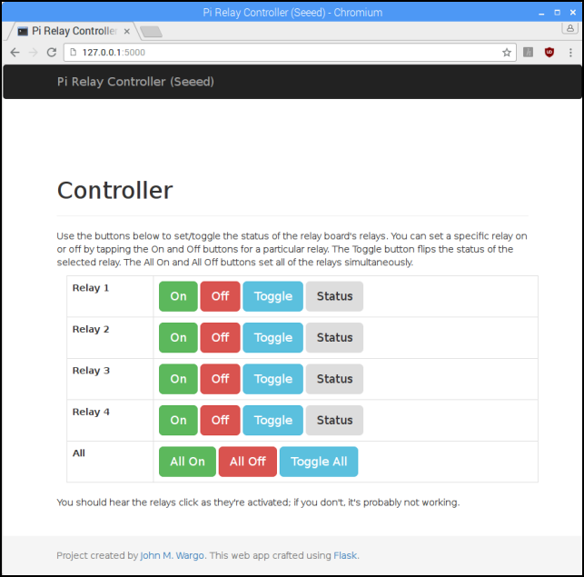
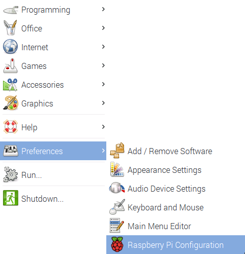
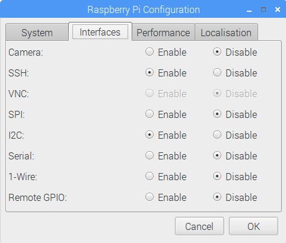
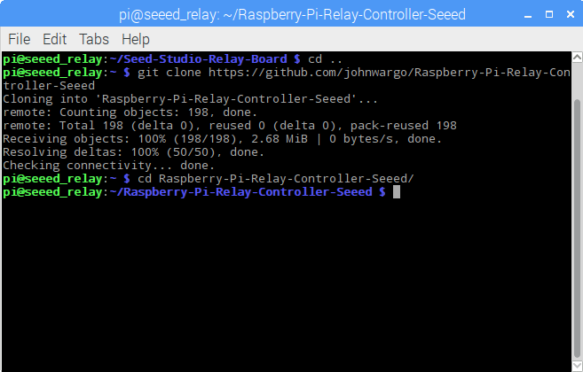
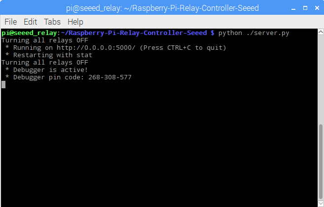
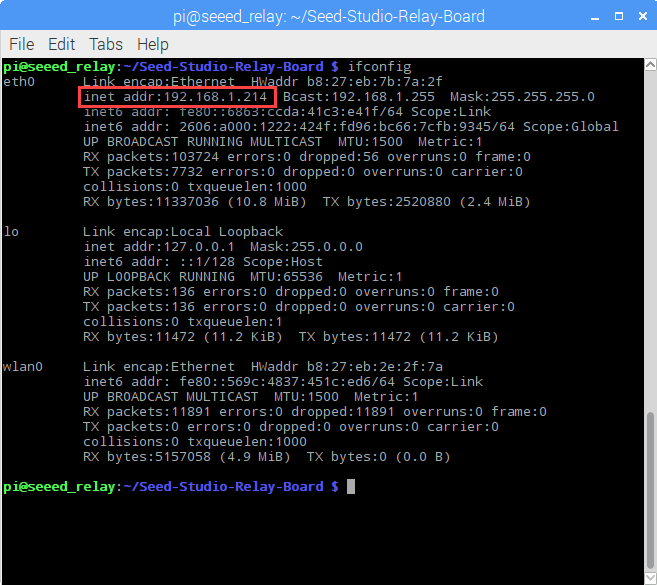
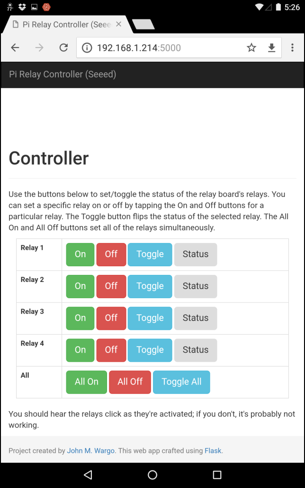

# Raspberry Pi Relay Controller for the Seeed Studio Raspberry Pi Relay Board (v1.0)

The [Seeed Studio Raspberry Pi Relay Board v1.0](https://www.seeedstudio.com/Raspberry-Pi-Relay-Board-v1.0-p-2409.html) is a 4-port relay controller board for the Raspberry Pi. The folks at Seeed Studio provide a rudimentary Python library for the board, but I wanted more. I copied their library from their Wiki page, formatted it for immediate use (it wouldn't run when copied from the Wiki page) and published it to my [Seed Studio Relay Board Github Repository](https://github.com/johnwargo/Seed-Studio-Relay-Board). I also created a cleaner Python library to use with the board plus a Python application you can use to exercise the board.

In my initial library, I implemented functions that allow a developer to turn any or all relays on and off, but little else. I wanted the ability to toggle a relay's status as well as read the current state of a relay (on or off). As I worked on that enhanced version of the library (finished and published to the Github repository), I needed an easy way to control the status of the board's relays as I tested the library's code.

I needed a simple app I could run from the browser (on the Pi, my development system or a smartphone), that allowed me to easily utilize each of the functions exposed by my library. That's what I created, and this is the Github repository for that project. The application is a Python application built using the [Flask micro framework](http://flask.pocoo.org/). When you run the application, it starts a simple web server that hosts the web page shown in the following figure as well as a series of APIs used by the web application.

   
When you tap/click any of the buttons in the app, the corresponding API on the server is triggered which calls the appropriate library functions to do things on the relay controller. Simple stuff! Check out the [Relay board library Repository](https://github.com/johnwargo/Seed-Studio-Relay-Board) for details on the library functions. 

## Hardware Components

To use this project, you'll need at a minimum the following hardware components:

+ [Raspberry Pi 3](https://www.raspberrypi.org/products/raspberry-pi-3-model-b/)
+ [Seeed Studio Raspberry Pi Relay Board v1.0](https://www.seeedstudio.com/Raspberry-Pi-Relay-Board-v1.0-p-2409.html)
+ 5V, 2.5A Micro USB power source (basically, a smartphone charger) - I use the [CanaKit 5V 2.5A Raspberry Pi 3 Power Supply/Adapter/Charger](https://www.amazon.com/gp/product/B00MARDJZ4)
 
## Assembly

To assemble the hardware, mount the relay board on the Raspberry Pi as shown in the following figure. The relay board is designed for older Raspberry Pi's (they have less GPIO pins), so, as you can see, not all of the pins from the relay board will connect to the Raspberry Pi.  

To keep the boards from touching, you should use standoffs between the boards to hold them in place. The folks at Seeed Studio recommend placing a piece (or two) of electrical tape on top of the Raspberry Pi's Ethernet connector to protect the relay board from shorting out if the two boards touch there.

## Configuring Your Raspberry Pi

Download the latest version of the Raspbian OS from the [Raspberry Pi web site](https://www.raspberrypi.org/downloads/raspbian/) and follow the [instructions](https://www.raspberrypi.org/documentation/installation/installing-images/README.md) for writing the OS image to a Micro SD card for the Pi. Insert the **SD card** in the Pi, connect **Ethernet**, **keyboard**, **mouse**, and a **monitor** to the Pi and finally **power it up** using a smartphone charger or some suitable power source.

The relay board communicates with the Raspberry Pi using the I2C interface. This interface is disabled by default on Raspbian, so the first thing you'll want to do is open the **Raspberry Pi menu** (in the upper-left corner of the screen), select **Preferences**, then **Raspberry Pi Configuration** as shown in the following figure:

In the **Raspberry Pi Configuration** application, select the **Interfaces** tab and enable the I2C radio button a shown in the following figure.

Raspbian comes configured with its keyboard, timezone, and other locale settings configured for the United Kingdom (UK), so if you're in the US, or elsewhere that's not the UK, you'll want to switch over to the **localisation** tab and adjust the settings there as well.

When you're done configuring I2C and the locale settings, you'll likely be prompted to reboot the Pi. Go ahead and do that before continuing. 

### Validating Hardware Assembly

When the Pi comes back up, open a terminal window and execute the following command:

	sudo apt-get update

This updates the local catalog of applications. Next, execute the following command:

	sudo apt-get upgrade

This command will update the Raspbian OS with all updates released after the latest image was published. The update process will take a long time, so pay attention, answer any prompts, and expect this process to take a few minutes or more (the last time I did this, it took about 15 minutes or more to complete).

After the upgrade completes, in the terminal window, execute the following command:

	i2cdetect -y -r 1

This runs a Linux application that looks for I2C connections on the Raspberry Pi. When you run the application, you should see output similar to what's shown in the following figure:

In this example, it's showing that the relay board is available at I2C address 20. If you've messed with the switches on the relay board, you might see a different number in the output. If you do, make note of that number, you'll need to update the library code later to make it work with your board's configuration.

> **Note**: if you don't see a number in the dashed output shown in the figure, there's something wrong, the Pi doesn't see the board. At this point, I'd reach out to the folks at Seeed Studio or their community forums (not well monitored, unfortunately) for help.

Now, lets download and test the library, in the terminal window, execute the following command:

	git clone https://github.com/johnwargo/Seed-Studio-Relay-Board

This will download the relay library and test application from its Github repository and copy the files to the local (relative to your terminal window) `Seed-Studio-Relay-Board` folder.

> **Note**: capitalization matters in those commands, so pay close attention. Also, the Seeed in *Seeed Studio*, for some bizarre reason, has three e's in it, so make sure you've typed enough e's.

Next, change to the folder you just created by executing the following command:

	cd Seed-Studio-Relay-Board

Your terminal window prompt should change to reflect the switch to the new folder.

If your relay board's I2C address is different than `20`, open the `relay_lib_seeed.py` file, and look for the following two lines:

	# Change the following value if your Relay board uses a different I2C address. 
	DEVICE_ADDRESS = 0x20  # 7 bit address (will be left shifted to add the read write bit)

Change the `0x20` in the line to the appropriate value for your configuration, replacing only the `20` with the address for your board.

Now, finally, execute the following command:

	python ./relay_lib_seeed_test.py

This executes the relay library's test application, if everything is working correctly, it will turn all of the relays on for a second, turn them all off for a second, then toggle each relay in succession on and off until you press the **ctrl**+**C** keys to make it stop. When the application runs, you should see something similar to the following in the terminal window: 

At this point, you should have a functional relay board configuration and know with certainty that the relay library works. 

## Software Installation

The controller's Flask application uses the Flask Bootstrap plugin to serve [Bootstrap](http://getbootstrap.com/) applications, so in the terminal window, install the plugin by executing the following command:  

	sudo pip install flask_bootstrap

Finally, clone the controller application to your local system. Assuming your terminal window is currently pointing to the `Seed-Studio-Relay-Board` folder, navigate back to the `pi` user's home folder and clone the repository by executing the following commands:

	cd .. 
	git clone https://github.com/johnwargo/Raspberry-Pi-Relay-Controller-Seeed
	cd Raspberry-Pi-Relay-Controller-Seeed

Your terminal window should look something like this:
 

Now, let start the server application. In the terminal window pointing to the `Raspberry-Pi-Relay-Controller-Seeed` folder (you changed to this folder with the last command you typed), execute the following command:

	python ./server.py

The application will launch and tell you that it's running on http://0.0.0.0:5000 as shown in the following figure. This may seem weird, as that's not a valid IP address, but I had to configure the server application to load with that address to get it to listen to requests from external to the Raspberry Pi. You'll see how this works in a minute.    

## Accessing the Web Application

To access the web application on the Raspberry Pi, open the Pi's browser and type the following address in the browser's address bar:

	http://127.0.0.1:5000

That's the default address for `localhost` which means the local system you're running on. The `:5000` tells the browser what port the target application is running on. When you press **Enter**, the browser should open the web application shown in the following figure. Click some of the buttons, and you should hear the relay board click in response (as relays close and open) and the LEDs on the board should illuminate when each relay is on.

If the application doesn't appear as expected, I'm  not sure what to tell you. Go back over the previous steps and check to see that everything is as described in this document.

> **Note**: The `localhost` address (`127.0.0.1) is not visible to any computer systems external to the system, only applications running on the system can access local server resources using that address. Do not fire up the browser on your desktop PC or your smartphone and try to access the server using that address. It will not work.

In order to be able to access this web application from a different computer, you need to know the Raspberry Pi's Internet Protocol (IP) address. To get this address, open a new terminal window (the terminal widow you already have is busy running the server application) and execute the following command:

	ifconfig

An application will run and dump all of the network interface information to the terminal window as shown in the following figure. Look for the Pi's `inet addr` value highlighted in red in the figure; the value after the colon (:) is the Pi's IP address.

> **Note**: In the figure, `eth0` refers to Ethernet port 0 (the Pi only has one) and indicates that I'm connected to the network using a Ethernet cable (not wireless). If your Raspberry Pi is using a wireless network (Wi-Fi), then look for the IP address in the `wlan0` entry shown at the bottom of the data.

With that IP address in hand, fire up your desktop, smartphone or tablet browser and use the address in the following format:

	http://ip_address:port

So, for my example shown above, with an IP address of `196.168.1.214` and we already know the server application is listening on port `5000`, the server address would be:

	http://192.168.1.214:5000

When you type this in and press enter (or tap go), the web application should open as shown in the following figure. In this example, the web application is running on a Nexus 7 tablet.

Now, when you start tapping buttons in the application, you can roam around the room or house as you do it.

> **Note**: The web application will only be accessible to devices that are on the same network as the Raspberry Pi. There are some cool things you can do to expose this functionality to computer systems outside of your home network, but it's waaaaaay beyond the scope of this readme to cover that topic.

## Starting The Project's Application's Automatically

Ok, so right now, the server is only running because you started it manually. There are a few steps you must complete to configure the Raspberry Pi so it executes the the relay controller app on startup. You can read more about this here: [Autostart Python App on Raspberry Pi in a Terminal Window](http://johnwargo.com/index.php/microcontrollers-single-board-computers/autostart-python-app-on-raspberry-pi-in-a-terminal-window.html).

If you don't already have a terminal window open, open one then navigate to the folder where you extracted the project files (if you followed these instructions, it should be at `home/pi/Seed-Studio-Relay-Board`. 

1.	Make the project's bash script file (`start-server.sh`) executable by executing the following command:

    	chmod +x start-server.sh
    
2.	Open the pi user's session autostart file using the following command:  

		sudo nano ~/.config/lxsession/LXDE-pi/autostart    

3.	Add the following line to the end (bottom) of the file:

		@lxterminal -e /home/pi/Seed-Studio-Relay-Board/start-server.sh

	To save your changes, press `ctrl-o` then press the Enter key. Next, press `ctrl-x` to exit the `nano` application.
  
4.	Reboot the Raspberry Pi; when it restarts, the controller server process should execute in its own terminal window.

## Resources

Links to the wiki page and my article and sample code

## Update History

Nothing yet.

***
By [John M. Wargo](http://www.johnwargo.com) - If you find this code useful, and feel like thanking me for providing it, please consider making a purchase from [my Amazon Wish List](https://amzn.com/w/1WI6AAUKPT5P9). You can find information on many different topics on my [personal blog](http://www.johnwargo.com). Learn about all of my publications at [John Wargo Books](http://www.johnwargobooks.com). 